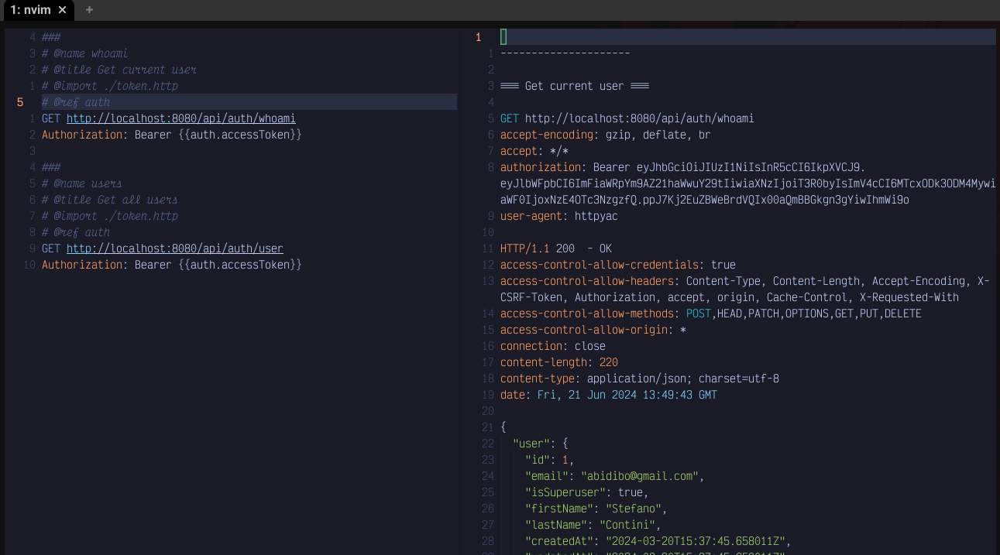

# Neovim HttpYac



A very simple plugin which integrates [HttpYac](https://httpyac.github.io/) in Neovim.

I currently use it to to run REST requests, I don't need much, but I'll add functionalities once I need them.

It basically runs httpyac cli against the current file, executing all request or the one under the cursor, so you can use vars, envs, etc...    
It provides syntax highlighting for the responses.

## Installation

With [LazyVim](https://github.com/LazyVim/LazyVim):

```lua
return {
  "abidibo/nvim-httpyac",
  config = function ()
    require('nvim-httpyac').setup()
    -- if you want to set up the keymaps
    vim.keymap.set('n', '<Leader>rr', '<cmd>:NvimHttpYac<CR>', { desc='Run request'})
    vim.keymap.set('n', '<Leader>ra', '<cmd>:NvimHttpYacAll<CR>', { desc='Run all requests'})
  end
}
```

## Commands

- **NvimHttpYac**: executes the request under the cursor
- **NvimHttpYacAll**: executes all the requests

## Credits

This plugin was inspired by the following projects:

- [HttpYac](https://httpyac.github.io/): for the great cli tool
- [rest.nvim](https://github.com/rest-nvim/rest.nvim): for the syntax highlighting
- [vimyac](https://github.com/oxcafedead/vimyac): for the idea
