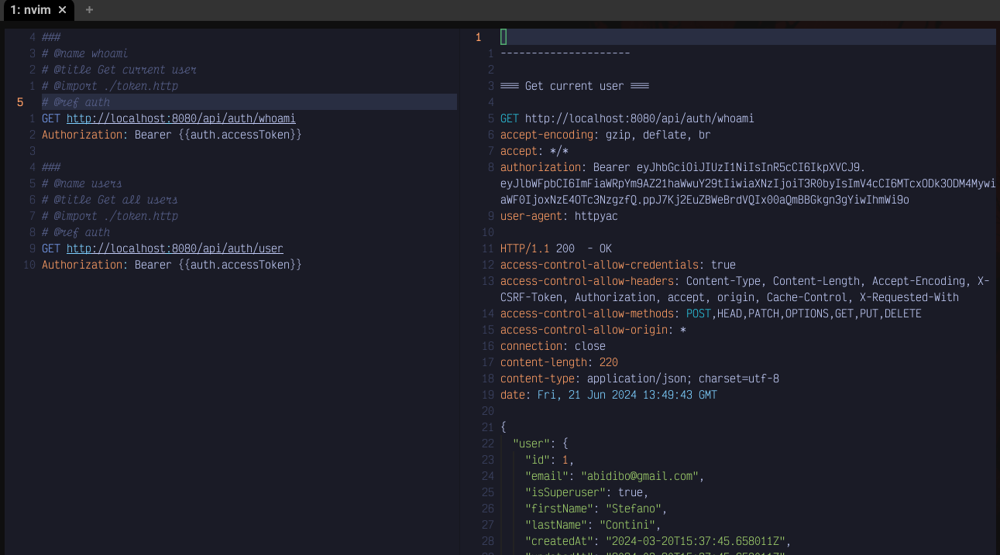

# Neovim HttpYac

<p align="center">
  
</p>

<p align="center">
  <a href="https://neovim.io/"></a>
  <a href="https://httpyac.github.io/"></a>
  
</p>

A lightweight Neovim plugin that brings [HttpYac](https://httpyac.github.io/) into your editor — run REST requests, switch environments, and replay sequences without leaving the buffer.

## Features

- **Run requests** under the cursor or all at once against the current buffer
- **Named request picker** to jump to any request in the file
- **Sticky environments** — pick once, apply to every subsequent request
- **Environment auto-discovery** for IntelliJ `http-client.env.json` and dotenv files
- **Request sequences** — record, save, and replay ordered chains of named requests
- **Syntax-highlighted responses** in a split view
- **Async execution** — your editor stays responsive while requests run

> [!IMPORTANT]
> [HttpYac](https://httpyac.github.io/) must be installed and available on your `PATH`:
> ```sh
> npm install -g httpyac
> ```

## Installation

### Quickstart ([lazy.nvim](https://github.com/folke/lazy.nvim))

```lua
return {
  "abidibo/nvim-httpyac",
  config = function()
    require("nvim-httpyac").setup()
  end,
}
```

<details>
<summary><b>Full setup with keymaps</b></summary>

```lua
return {
  "abidibo/nvim-httpyac",
  config = function()
    require("nvim-httpyac").setup({
      output_view = "vertical", -- "vertical" | "horizontal"
    })

    vim.keymap.set("n", "<Leader>rr", "<cmd>NvimHttpYac<CR>",               { desc = "Run request under cursor" })
    vim.keymap.set("n", "<Leader>ra", "<cmd>NvimHttpYacAll<CR>",            { desc = "Run all requests" })
    vim.keymap.set("n", "<Leader>rp", "<cmd>NvimHttpYacPicker<CR>",         { desc = "Pick a named request" })
    vim.keymap.set("n", "<Leader>re", "<cmd>NvimHttpYacEnv<CR>",            { desc = "Select environment" })
    vim.keymap.set("n", "<Leader>rc", "<cmd>NvimHttpYacEnvClear<CR>",       { desc = "Clear environment" })
    vim.keymap.set("n", "<Leader>rq", "<cmd>NvimHttpYacSequence<CR>",       { desc = "Toggle sequence recording" })
    vim.keymap.set("n", "<Leader>rs", "<cmd>NvimHttpYacSequencePicker<CR>", { desc = "Sequence picker" })
  end,
}
```

</details>

## Configuration

| Option        | Type     | Default      | Description                                                      |
| ------------- | -------- | ------------ | ---------------------------------------------------------------- |
| `output_view` | `string` | `"vertical"` | How the response window opens. Either `"vertical"` or `"horizontal"`. |

## Commands

> [!TIP]
> You don't need to save the file first — the current buffer content is what gets executed.

| Command                     | Description                                                                                   |
| --------------------------- | --------------------------------------------------------------------------------------------- |
| `:NvimHttpYac`              | Execute the request under the cursor                                                          |
| `:NvimHttpYacAll`           | Execute all requests in the buffer                                                            |
| `:NvimHttpYacPicker`        | Pick a named request from a list                                                              |
| `:NvimHttpYacEnv`           | Select an environment (sticky across subsequent requests)                                     |
| `:NvimHttpYacEnvClear`      | Clear the active environment                                                                  |
| `:NvimHttpYacSequence`      | Toggle sequence recording; on stop, prompts for a name (ESC to discard)                       |
| `:NvimHttpYacSequencePicker`| Browse saved sequences with a Run/Delete menu                                                 |

The first three commands accept extra arguments that are forwarded to `httpyac`. For example:

```vim
:NvimHttpYac --env dev
```

## Usage

<details>
<summary><b>Environment selector</b></summary>

`:NvimHttpYacEnv` auto-discovers environments by scanning for:

- `http-client.env.json` / `http-client.private.env.json` (IntelliJ format — top-level keys are environment names)
- `.env.{name}` and `{name}.env` dotenv files

Files are searched in the current file's directory, the project root, and an `env/` subfolder.

Once selected, the environment is **sticky**: it's appended to every subsequent request until cleared with `:NvimHttpYacEnvClear` or replaced by another selection. Passing `--env` explicitly on a command overrides the sticky environment for that one call.

</details>

<details>
<summary><b>Sequences</b></summary>

`:NvimHttpYacSequence` toggles recording mode. While active, every named request you run via `:NvimHttpYacPicker` is captured. Stopping recording prompts for a sequence name — press `Enter` to save, `ESC` to discard. Unnamed requests (cursor-based or run-all) are skipped with a warning suggesting you add a `# @name` annotation.

Sequences are persisted to `.httpyac-sequences.json` in the project root. Use `:NvimHttpYacSequencePicker` to browse, run, or delete them.

When a sequence runs, requests execute one after another in the recorded order. Output is appended to the response buffer as each request completes. If any request fails, the sequence is aborted and an error is shown.

</details>

## Credits

Inspired by and built on the shoulders of:

- [HttpYac](https://httpyac.github.io/) — the CLI that does the heavy lifting
- [rest.nvim](https://github.com/rest-nvim/rest.nvim) — response syntax highlighting
- [vimyac](https://github.com/oxcafedead/vimyac) — for the idea

## License

See [LICENSE](LICENSE) for details.
